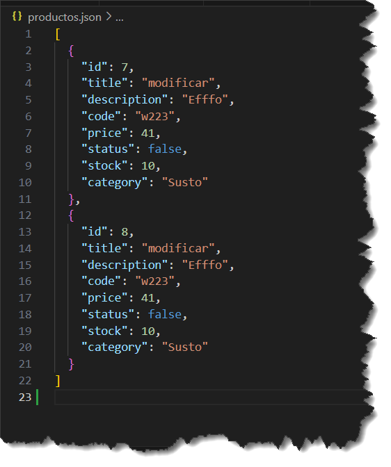

# Pre-entrega1-Backend
`Este proyecto es un backend para la gestión de productos y carritos de compras. Está construido con Node.js y Express y permite realizar operaciones CRUD (Crear, Leer, Actualizar, Eliminar) en productos y carritos. A continuación, se detallan las rutas implementadas y cómo interactuar con ellas utilizando Postman.`

`En este proyecto se han implementado varias rutas para manejar las operaciones CRUD tanto para productos como para carritos.`

## Estructura de Carpetas y Archivos

Pre-entrega1-Backend/
│
├── carts.json
├── productos.json
└── src/
    ├── app.js
    ├── routes/
    │   └── api/
    │       ├── carts.js
    │       └── products.js

# Métodos Implementados #

# Productos

## Lectura de un Producto por ID

GET: http://localhost:8080/api/products/:id
Ejemplo: http://localhost:8080/api/products/7
Respuesta:
[
    {
        "id": 7,
        "title": "modificar",
        "description": "Efffo",
        "code": "w223",
        "price": 41,
        "status": false,
        "stock": 10,
        "category": "Susto"
    }
]

## Lectura de Productos con Límite
GET: http://localhost:8080/api/products/?limit=1
Ejemplo Respuesta:
[
    {
        "id": 7,
        "title": "modificar",
        "description": "Efffo",
        "code": "w223",
        "price": 41,
        "status": false,
        "stock": 10,
        "category": "Susto"
    }
]

## Agregar un Producto
El ID es automatico.
POST: http://localhost:8080/api/products
Ejemplo BODY::
{
    "title": "titulo ere", 
    "description": "Este es un ejemplo", 
    "code": "223",
    "price": 45, 
    "status": false, 
    "stock": 10, 
    "category": "Susto" 
}

## Actualizar un Producto
PUT: http://localhost:8080/api/products/:id
Ejemplo BODY::
{
    "title": "modificar", 
    "description": "Efffo", 
    "code": "w223",
    "price": 41, 
    "status": false, 
    "stock": 10, 
    "category": "Susto" 
}

## Eliminar un Producto
DELETE: http://localhost:8080/api/products/:id
Ejemplo Respuesta:
{
    "message": "Producto con ID 1 eliminado"
}

## Lectura de Todos los Productos
GET: http://localhost:8080/api/products
Ejemplo Respuesta:
[
    {
        "id": 7,
        "title": "modificar",
        "description": "Efffo",
        "code": "w223",
        "price": 41,
        "status": false,
        "stock": 10,
        "category": "Susto"
    },
    {
        "id": 8,
        "title": "modificar",
        "description": "Efffo",
        "code": "w223",
        "price": 41,
        "status": false,
        "stock": 10,
        "category": "Susto"
    }
]

# Carrito

## Crear un Carrito (id automatico)
POST: http://localhost:8080/api/carts
Ejemplo BODY:
{
    "products": [
    ]
}

Leer el Contenido de un Carrito
GET: http://localhost:8080/api/carts/:cid
Ejemplo: http://localhost:8080/api/carts/2
Respuesta:
{
    "id": 2,
    "products": [
        {
            "quantity": 60,
            "producto": {
                "id": 7,
                "title": "modificar",
                "description": "Efffo",
                "code": "w223",
                "price": 41,
                "status": false,
                "stock": 10,
                "category": "Susto"
            }
        }
    ]
}

## Agregar Producto a un Carrito
POST: http://localhost:8080/api/carts/:cid/products/:pid
Ejemplo: http://localhost:8080/api/carts/2/products/7
Ejemplo BODY:
{
    "quantity": 1
}

